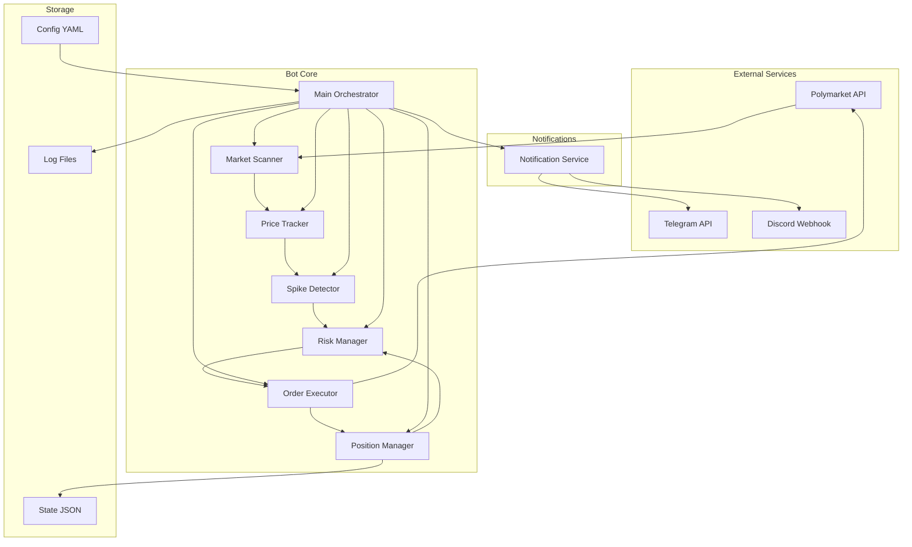
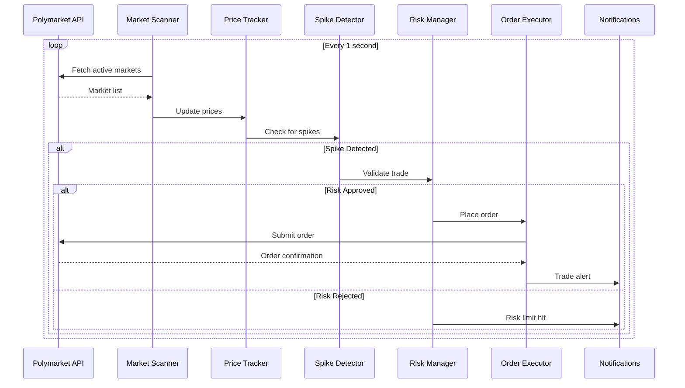
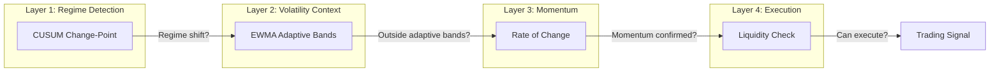

# Polymarket Spike Hunter Bot - Architecture Plan

## Modes of Operation

### 1. Dry-Run Mode (Paper Trading)
- **Purpose**: Test the bot without risking real money
- **Behavior**:
  - Connects to real Polymarket API for price data
  - Detects spikes and generates signals normally
  - Simulates order execution (no actual orders placed)
  - Tracks virtual positions and P&L
  - Sends notifications for simulated trades
- **Configuration**: Set `dry_run: true` in config.yaml
- **Output**: Full trade logs showing what would have been executed

### 2. Live Trading Mode
- **Purpose**: Execute real trades on Polymarket
- **Behavior**: Places actual orders with real money
- **Configuration**: Set `dry_run: false` in config.yaml
- **Safety**: Requires explicit confirmation flag

## Overview

A Python-based trading bot that detects and capitalizes on short-term price spikes in Polymarket prediction markets. The bot monitors price movements, identifies volatility spikes, and executes quick trades to capture small profits.

## Configuration

| Parameter | Value |
|-----------|-------|
| Initial Capital | $75 USD |
| Max Daily Loss | $2 USD |
| Position Size | $1-3 per trade |
| Target Profit | 2-4% per trade |
| Stop Loss | 1-2% per trade |
| Markets | All active markets |
| Polling Interval | 1 second |
| Deployment | AWS EC2 + Docker |
| Notifications | Telegram + Discord |

## System Architecture



## Trading Flow



## Module Specifications

### 1. Configuration Manager
- **File**: `src/config/settings.py`
- **Purpose**: Load and validate configuration from YAML and environment variables
- **Key Settings**:
  - API credentials (from env vars)
  - Trading parameters (position size, thresholds)
  - Risk limits (daily loss, max positions)
  - Notification settings

### 2. Market Scanner
- **File**: `src/core/scanner.py`
- **Purpose**: Discover and filter active markets
- **Features**:
  - Fetch all active markets from Polymarket
  - Filter by minimum volume/liquidity
  - Prioritize high-activity markets
  - Cache market metadata

### 3. Price Tracker
- **File**: `src/core/tracker.py`
- **Purpose**: Maintain real-time price history
- **Features**:
  - Rolling window of last 30-60 prices per market
  - Calculate price velocity and momentum
  - Efficient memory management using deques
  - Support concurrent market tracking

### 4. Spike Detector (Adaptive Regime-Change Detection)
- **File**: `src/core/detector.py`
- **Purpose**: Detect regime changes in prediction markets using mathematically proven methods

#### Why This Approach Works for Prediction Markets

Prediction markets have unique characteristics:
- Prices are bounded probabilities (0 to 1)
- News events cause discrete, sudden shifts
- Markets tend toward efficiency after initial overreaction
- High volatility periods are distinct from calm periods

The strategy exploits the **overreaction pattern**: news hits → panic → spike → calm down → profit from the bounce.

#### Multi-Layer Detection System



#### Layer 1: CUSUM (Cumulative Sum Control Chart)

**Origin**: Invented at Bell Labs, mathematically proven optimal for detecting mean shifts.

```python
# CUSUM detects when cumulative deviations exceed a threshold
# This catches regime changes, not just random fluctuations

def cusum_detection(prices, target_mean, threshold_h, slack_k):
    cusum_pos = 0  # Detects upward shifts
    cusum_neg = 0  # Detects downward shifts
    
    for price in prices:
        deviation = price - target_mean
        cusum_pos = max(0, cusum_pos + deviation - slack_k)
        cusum_neg = max(0, cusum_neg - deviation - slack_k)
        
        if cusum_pos > threshold_h:
            return RegimeChange.UPWARD
        if cusum_neg > threshold_h:
            return RegimeChange.DOWNWARD
    
    return RegimeChange.NONE
```

**Why it works**: Unlike simple thresholds that trigger on noise, CUSUM accumulates evidence. Small random moves cancel out; sustained directional moves accumulate and trigger.

#### Layer 2: EWMA Adaptive Volatility Bands

**Origin**: J.P. Morgan RiskMetrics, industry standard for adaptive risk measurement.

```python
# EWMA gives more weight to recent observations
# Bands automatically widen in volatile periods, narrow in calm periods

def calculate_ewma_bands(prices, span=20):
    ewma_mean = prices.ewm(span=span).mean()
    ewma_std = prices.ewm(span=span).std()
    
    # Adaptive bands - self-adjusting to market conditions
    upper_band = ewma_mean + (2.5 * ewma_std)
    lower_band = ewma_mean - (2.5 * ewma_std)
    
    return upper_band, lower_band, ewma_std
```

**Why it works**:
- In calm markets: bands are tight → small moves trigger signals
- In volatile markets: bands are wide → only large moves trigger signals
- This prevents false triggers during already-volatile periods

#### Layer 3: Momentum Confirmation (ROC)

```python
def rate_of_change(prices, periods=3):
    # Measures velocity of price movement
    roc = (prices[-1] - prices[-periods]) / prices[-periods] * 100
    return roc
```

**Confirmation logic**: Only trade when momentum direction matches the detected regime change. This filters out false positives.

#### Layer 4: Liquidity Check

```python
def check_liquidity(orderbook, min_liquidity_usd=50):
    # Ensure we can actually execute the trade
    best_bid = orderbook.bids[0].price if orderbook.bids else 0
    best_ask = orderbook.asks[0].price if orderbook.asks else 1
    spread = best_ask - best_bid
    
    bid_depth = sum(b.size * b.price for b in orderbook.bids[:5])
    ask_depth = sum(a.size * a.price for a in orderbook.asks[:5])
    
    return (
        spread < 0.05 and  # Max 5% spread
        min(bid_depth, ask_depth) > min_liquidity_usd
    )
```

#### Combined Signal Generation

```python
class AdaptiveSpikeDetector:
    def __init__(self, config):
        self.cusum_threshold = config.cusum_threshold  # 0.03 for 3%
        self.cusum_slack = config.cusum_slack  # 0.005
        self.ewma_span = config.ewma_span  # 20 periods
        self.ewma_multiplier = config.ewma_multiplier  # 2.5 std devs
        self.roc_threshold = config.roc_threshold  # 1.0%
        self.min_liquidity = config.min_liquidity  # $50
        
    def generate_signal(self, market_data):
        prices = market_data.price_history
        
        # Layer 1: Has a regime change occurred?
        target_mean = prices.ewm(span=self.ewma_span).mean().iloc[-1]
        regime = self.cusum_detection(prices, target_mean)
        
        if regime == RegimeChange.NONE:
            return None
            
        # Layer 2: Is price outside adaptive volatility bands?
        upper, lower, volatility = self.calculate_ewma_bands(prices)
        current_price = prices.iloc[-1]
        
        band_breach = (
            current_price > upper.iloc[-1] or
            current_price < lower.iloc[-1]
        )
        
        if not band_breach:
            return None
            
        # Layer 3: Does momentum confirm the direction?
        roc = self.rate_of_change(prices)
        momentum_confirms = (
            (regime == RegimeChange.UPWARD and roc > self.roc_threshold) or
            (regime == RegimeChange.DOWNWARD and roc < -self.roc_threshold)
        )
        
        if not momentum_confirms:
            return None
            
        # Layer 4: Can we actually execute?
        if not self.check_liquidity(market_data.orderbook):
            return None
            
        # All layers passed - generate signal
        direction = "BUY" if regime == RegimeChange.UPWARD else "SELL"
        
        return TradingSignal(
            market=market_data.id,
            direction=direction,
            confidence=1.0,  # High confidence - all layers passed
            regime_change=regime,
            roc=roc,
            volatility=volatility.iloc[-1],
            entry_price=current_price
        )
```

#### Adaptive Exit Strategy (ATR-Based Trailing Stop)

```python
def calculate_exit_levels(entry_price, volatility, direction):
    # ATR-based stops adapt to current market volatility
    atr_multiplier = 2.0
    
    if direction == "BUY":
        stop_loss = entry_price - (volatility * atr_multiplier)
        take_profit = entry_price + (volatility * atr_multiplier * 1.5)
    else:
        stop_loss = entry_price + (volatility * atr_multiplier)
        take_profit = entry_price - (volatility * atr_multiplier * 1.5)
    
    return stop_loss, take_profit

def update_trailing_stop(current_price, current_stop, volatility, direction):
    # Trail stop behind price as profit grows
    if direction == "BUY":
        new_stop = current_price - (volatility * 1.5)
        return max(current_stop, new_stop)  # Only move stop up
    else:
        new_stop = current_price + (volatility * 1.5)
        return min(current_stop, new_stop)  # Only move stop down
```

#### Why This Algorithm is More Robust

| Feature | Static Thresholds | Adaptive System |
|---------|------------------|-----------------|
| Quiet markets | Miss opportunities | Catches small moves |
| Volatile markets | False triggers | Ignores noise |
| Parameter tuning | Manual, constant | Self-adjusting |
| Regime changes | Delayed detection | Early detection |
| Exit strategy | Fixed % | Volatility-based |

#### Configurable Parameters (Plain English)

| Parameter | Default | What It Does |
|-----------|---------|--------------|
| **cusum_threshold** | 0.03 | **Spike trigger level** - How much total price deviation before we trade. Think of it as "the price needs to drift 3 cents away from normal before I act." Lower = more trades but more false alarms. |
| **cusum_slack** | 0.005 | **Noise filter** - Ignores tiny wiggles. Like saying "ignore any move less than half a cent." Keeps us from trading on random noise. |
| **ewma_span** | 20 | **Memory length** - How many price points to remember when calculating "normal." 20 means we look at the last 20 seconds. Higher = slower to react but more stable. |
| **ewma_multiplier** | 2.5 | **Band width** - How far from normal a price must be to count as unusual. 2.5 means "2.5x the normal wobble." Higher = only catches extreme moves. |
| **roc_threshold** | 1.0% | **Minimum speed** - Price must be moving at least this fast. If price jumped but stopped moving, we skip it. Ensures we catch active spikes, not stale ones. |
| **roc_periods** | 3 | **Speed measurement window** - How many seconds to measure momentum over. 3 means "compare now to 3 seconds ago." |
| **min_liquidity_usd** | 50 | **Minimum market depth** - Only trade if there's at least $50 available in the orderbook. Avoids getting stuck in dead markets. |
| **cooldown_seconds** | 30 | **Rest period** - After trading a market, wait 30 seconds before trading it again. Prevents overtrading the same spike. |
| **atr_stop_multiplier** | 2.0 | **Stop loss distance** - Place stop loss at 2x the current volatility. In calm markets, stops are tight. In wild markets, stops are wider. |
| **atr_profit_multiplier** | 3.0 | **Profit target distance** - Take profit at 3x volatility. Risk/reward ratio of 1.5:1 (risk 2 to make 3). |

**Simple analogy**: Imagine you're watching for waves at the beach.
- **cusum_threshold** = How big a wave before you notice
- **cusum_slack** = Ignore ripples smaller than this
- **ewma_span** = How long you've been watching (experience)
- **ewma_multiplier** = How unusual compared to typical waves
- **roc_threshold** = Wave must still be growing, not just a splash
- **cooldown_seconds** = Don't jump at every wave, rest between swims

### 5. Order Executor
- **File**: `src/core/executor.py`
- **Purpose**: Execute trades via py-clob-client
- **Features**:
  - Place limit and market orders
  - Handle order lifecycle (pending, filled, cancelled)
  - Implement retry logic for failed orders
  - Track order history

### 6. Position Manager
- **File**: `src/core/position_manager.py`
- **Purpose**: Track and manage open positions
- **Features**:
  - Track entry price, size, and P&L
  - Implement take-profit logic (2-4% gain)
  - Implement stop-loss logic (1-2% loss)
  - Persist state to disk for recovery

### 7. Risk Manager
- **File**: `src/risk/risk_manager.py`
- **Purpose**: Enforce trading limits
- **Rules**:
  - Daily loss limit: $2
  - Max position size: $3
  - Max concurrent positions: 2-3
  - Cooldown between same-market trades
  - Circuit breaker on consecutive losses

### 8. Notification Service
- **File**: `src/notifications/notifier.py`
- **Purpose**: Send alerts via Telegram and Discord
- **Events**:
  - Trade entry/exit
  - Daily P&L summary
  - Risk limit warnings
  - Error alerts

### 9. Web Dashboard (Dry-Run Monitoring)
- **File**: `src/dashboard/app.py`
- **Purpose**: Real-time visualization of bot activity during dry-run
- **Framework**: Streamlit (lightweight, Python-native, real-time updates)

#### Dashboard Layout (Simplified, User-Friendly)

```
┌──────────────────────────────────────────────────────────────────┐
│  🤖 POLYBOT                              📋 Paper Trading Mode   │
├──────────────────────────────────────────────────────────────────┤
│                                                                  │
│  TODAY'S PERFORMANCE                                             │
│  ═══════════════════                                             │
│  💰 Profit/Loss:  +$0.45    (You're up 45 cents today!)         │
│  📊 Win Rate:     67%       (4 wins out of 6 trades)            │
│  🎯 Open Trades:  1 of 2    (1 trade active, can open 1 more)   │
│                                                                  │
├──────────────────────────────────────────────────────────────────┤
│                                                                  │
│  MARKETS I'M WATCHING                                            │
│  ═══════════════════                                             │
│  🔴 Trump Win 2024     0.52 → 0.55  (+3.1%)  ⚡ SPIKE DETECTED! │
│     └─ Price jumped! Checking if we should trade...             │
│  🟢 ETH > $4000        0.31 → 0.30  (-0.5%)  Normal             │
│     └─ Small move, nothing to do                                │
│  🟢 Fed Rate Cut       0.78 → 0.78  ( 0.0%)  Quiet              │
│     └─ No movement, still watching                              │
│                                                                  │
├──────────────────────────────────────────────────────────────────┤
│                                                                  │
│  PRICE CHART: Trump Win 2024                                     │
│  ═══════════════════════════                                     │
│                                                                  │
│  0.56 │                         ╭─╮ ← Price spiked here!        │
│       │                        ╭╯ ╰╮                             │
│  0.54 │══════════════════════╭─╯═══╰═══ Sell Zone (Upper Band)  │
│       │                    ╭─╯                                   │
│  0.52 │  ──────────────────╯─────────── Normal Price            │
│       │                                                          │
│  0.50 │══════════════════════════════════ Buy Zone (Lower Band) │
│       └──────────────────────────────────────────────            │
│         10:00    10:05    10:10    10:15    10:20                │
│                                                                  │
│  📖 How to read this:                                           │
│     - Blue line = actual price                                  │
│     - Top band = price too high (sell opportunity)              │
│     - Bottom band = price too low (buy opportunity)             │
│     - 🔺 = Buy signal, 🔻 = Sell signal                         │
│                                                                  │
├──────────────────────────────────────────────────────────────────┤
│                                                                  │
│  RECENT TRADES                                                   │
│  ═════════════                                                   │
│  ✅ 10:15  Trump Win    SELL  $2.00  →  +$0.12 profit (+6%)     │
│     └─ Bot sold because price spiked too high, then it dropped  │
│  ❌ 10:02  ETH > $4k    BUY   $2.00  →  -$0.08 loss (-4%)       │
│     └─ Bot bought, but price kept falling. Stop loss triggered. │
│  ✅ 09:45  Fed Rate     SELL  $2.00  →  +$0.06 profit (+3%)     │
│     └─ Nice trade! Caught a small spike.                        │
│                                                                  │
├──────────────────────────────────────────────────────────────────┤
│                                                                  │
│  SAFETY CHECKS                                                   │
│  ═════════════                                                   │
│                                                                  │
│  Daily Loss Limit:                                               │
│  [$0.32]════════════░░░░░░░░░░░░░░░░░░░░░░░░░░░ $2.00 max       │
│  └─ If we lose $2 total today, bot stops trading to protect you │
│                                                                  │
│  Spike Detector:                                                 │
│  [0.025]═══════════════════════░░░░░░░░░░░░░░░░ 0.03 threshold  │
│  └─ Getting close! If this fills up, we might trade             │
│                                                                  │
│  Cooldown Timers:                                                │
│  └─ Trump Win 2024: 🔒 15 seconds left (just traded, waiting)   │
│  └─ Other markets: ✅ Ready to trade                             │
│                                                                  │
│  Circuit Breaker: ✅ All Systems Go                              │
│  └─ If too many losses in a row, this would show 🛑 STOPPED     │
│                                                                  │
└──────────────────────────────────────────────────────────────────┘
```

#### Dashboard Features (What Each Section Shows)

1. **Today's Performance** - The big picture
   - How much money you've made/lost today
   - Your success rate (winning trades ÷ total trades)
   - How many trades are currently active

2. **Markets I'm Watching** - What the bot sees
   - Each market with its current price
   - Color-coded status:
     - 🔴 Red = Spike detected, might trade soon!
     - 🟢 Green = Normal, just monitoring
   - Plain English explanation of what's happening

3. **Price Chart** - Visual spike detection
   - The wavy line is the actual price
   - Top/bottom bands show "unusual" zones
   - When price escapes the bands = spike!
   - Buy/sell markers show where bot acted

4. **Recent Trades** - Your trade history
   - Each trade with result (✅ profit or ❌ loss)
   - Plain English explanation of WHY the bot traded
   - Helps you understand the bot's decisions

5. **Safety Checks** - Protecting your money
   - **Daily Loss Limit**: Progress bar toward $2 max loss
   - **Spike Detector**: How close we are to triggering
   - **Cooldown Timers**: Which markets are temporarily off-limits
   - **Circuit Breaker**: Emergency stop status

#### Technical Implementation

```python
# src/dashboard/app.py
import streamlit as st
import plotly.graph_objects as go
from plotly.subplots import make_subplots
import json
from pathlib import Path
from datetime import datetime

# Configuration
STATE_FILE = Path("data/bot_state.json")
REFRESH_INTERVAL = 2  # seconds

def load_bot_state():
    """Load shared state from JSON file written by bot"""
    if STATE_FILE.exists():
        with open(STATE_FILE) as f:
            return json.load(f)
    return None

def render_price_chart(market_data):
    """Render price chart with EWMA bands and signals"""
    fig = make_subplots(rows=2, cols=1, row_heights=[0.7, 0.3],
                        shared_xaxes=True)
    
    # Price line
    fig.add_trace(go.Scatter(
        x=market_data['timestamps'],
        y=market_data['prices'],
        name='Price',
        line=dict(color='blue', width=2)
    ), row=1, col=1)
    
    # EWMA bands
    fig.add_trace(go.Scatter(
        x=market_data['timestamps'],
        y=market_data['ewma_upper'],
        name='Upper Band',
        line=dict(color='red', dash='dash')
    ), row=1, col=1)
    
    fig.add_trace(go.Scatter(
        x=market_data['timestamps'],
        y=market_data['ewma_lower'],
        name='Lower Band',
        line=dict(color='green', dash='dash')
    ), row=1, col=1)
    
    # Signal markers
    for signal in market_data.get('signals', []):
        marker_color = 'green' if signal['direction'] == 'BUY' else 'red'
        fig.add_trace(go.Scatter(
            x=[signal['timestamp']],
            y=[signal['price']],
            mode='markers',
            marker=dict(size=15, color=marker_color, symbol='triangle-up'),
            name=signal['direction']
        ), row=1, col=1)
    
    # CUSUM subplot
    fig.add_trace(go.Scatter(
        x=market_data['timestamps'],
        y=market_data['cusum_values'],
        name='CUSUM',
        line=dict(color='orange')
    ), row=2, col=1)
    
    fig.update_layout(height=500, showlegend=True)
    return fig

def main():
    st.set_page_config(
        page_title="Polybot Dashboard",
        layout="wide",
        initial_sidebar_state="collapsed"
    )
    
    # Auto-refresh using st.empty and time.sleep
    placeholder = st.empty()
    
    while True:
        with placeholder.container():
            state = load_bot_state()
            
            if state is None:
                st.warning("Waiting for bot to start...")
                continue
            
            # Header with mode indicator
            mode_color = "🟡" if state.get('dry_run', True) else "🔴"
            mode_text = "DRY-RUN" if state.get('dry_run', True) else "LIVE"
            st.title(f"Polybot Dashboard {mode_color} {mode_text}")
            st.caption(f"Last update: {state.get('timestamp', 'N/A')}")
            
            # Top row: Markets and Performance
            col1, col2 = st.columns(2)
            
            with col1:
                st.subheader("📊 Active Markets")
                for market in state.get('markets', [])[:5]:
                    change = market.get('change_pct', 0)
                    color = "green" if change > 0 else "red" if change < 0 else "gray"
                    st.markdown(
                        f"**{market['name']}** - {market['price']:.2f} "
                        f"<span style='color:{color}'>{change:+.1f}%</span>",
                        unsafe_allow_html=True
                    )
            
            with col2:
                st.subheader("💰 Performance")
                perf = state.get('performance', {})
                st.metric("Today P&L", f"${perf.get('daily_pnl', 0):.2f}")
                st.metric("Win Rate", f"{perf.get('win_rate', 0)*100:.0f}%")
                st.metric("Total Trades", perf.get('total_trades', 0))
            
            # Price chart
            st.subheader("📈 Price & Signals")
            if state.get('selected_market'):
                fig = render_price_chart(state['selected_market'])
                st.plotly_chart(fig, use_container_width=True)
            
            # Signal log
            st.subheader("📋 Signal Log")
            signals = state.get('signals', [])[-10:]  # Last 10
            for sig in reversed(signals):
                st.text(
                    f"{sig['timestamp']}  {sig['market']:20s}  "
                    f"{sig['direction']:4s}  ${sig['size']:.2f}  "
                    f"CUSUM: {sig['cusum']:.3f}  ROC: {sig['roc']:+.1f}%"
                )
            
            # Bottom row: Indicators and Risk
            col3, col4 = st.columns(2)
            
            with col3:
                st.subheader("🎯 Indicator Status")
                ind = state.get('indicators', {})
                cusum = ind.get('cusum', 0)
                cusum_thresh = 0.03
                st.progress(min(cusum / cusum_thresh, 1.0),
                           text=f"CUSUM: {cusum:.3f} / {cusum_thresh}")
                st.text(f"EWMA Volatility: {ind.get('ewma_vol', 0):.4f}")
                st.text(f"ROC: {ind.get('roc', 0):+.2f}%")
                st.text(f"Liquidity: {'✅ OK' if ind.get('liquidity_ok') else '❌ Low'}")
            
            with col4:
                st.subheader("⚠️ Risk Status")
                risk = state.get('risk', {})
                daily_loss = risk.get('daily_loss', 0)
                max_loss = 2.0
                st.progress(min(daily_loss / max_loss, 1.0),
                           text=f"Daily Loss: ${daily_loss:.2f} / ${max_loss:.2f}")
                st.text(f"Positions: {risk.get('open_positions', 0)} / 3")
                st.text(f"Cooldowns: {len(risk.get('cooldowns', []))} markets")
                circuit = "✅ Active" if risk.get('circuit_breaker_ok') else "🛑 TRIGGERED"
                st.text(f"Circuit Breaker: {circuit}")
        
        import time
        time.sleep(REFRESH_INTERVAL)

if __name__ == "__main__":
    main()
```

#### State File Format

The bot writes state to `data/bot_state.json` every second:

```json
{
    "timestamp": "2024-01-15T10:32:15Z",
    "dry_run": true,
    "markets": [
        {
            "id": "market_123",
            "name": "Trump Win 2024",
            "price": 0.52,
            "change_pct": 2.1
        }
    ],
    "selected_market": {
        "timestamps": ["10:30:00", "10:30:01", "..."],
        "prices": [0.50, 0.51, "..."],
        "ewma_upper": [0.53, 0.53, "..."],
        "ewma_lower": [0.47, 0.47, "..."],
        "cusum_values": [0.01, 0.015, "..."],
        "signals": [
            {
                "timestamp": "10:32:15",
                "direction": "BUY",
                "price": 0.52
            }
        ]
    },
    "signals": [
        {
            "timestamp": "10:32:15",
            "market": "Trump Win 2024",
            "direction": "BUY",
            "size": 2.00,
            "cusum": 0.035,
            "roc": 2.1
        }
    ],
    "performance": {
        "daily_pnl": 0.45,
        "win_rate": 0.67,
        "total_trades": 12
    },
    "risk": {
        "daily_loss": 0.32,
        "open_positions": 2,
        "cooldowns": ["market_456"],
        "circuit_breaker_ok": true
    },
    "indicators": {
        "cusum": 0.028,
        "ewma_vol": 0.015,
        "roc": 1.2,
        "liquidity_ok": true
    }
}
```

#### Running the Dashboard

```bash
# Install Streamlit
pip install streamlit plotly

# Run dashboard (separate terminal from bot)
streamlit run src/dashboard/app.py --server.port 8501

# Access at http://localhost:8501
```

## Project Structure

```
polybot/
├── src/
│   ├── __init__.py
│   ├── config/
│   │   ├── __init__.py
│   │   └── settings.py
│   ├── core/
│   │   ├── __init__.py
│   │   ├── scanner.py
│   │   ├── tracker.py
│   │   ├── detector.py
│   │   ├── executor.py
│   │   └── position_manager.py
│   ├── risk/
│   │   ├── __init__.py
│   │   └── risk_manager.py
│   ├── notifications/
│   │   ├── __init__.py
│   │   ├── telegram.py
│   │   ├── discord.py
│   │   └── notifier.py
│   └── utils/
│       ├── __init__.py
│       └── helpers.py
├── tests/
│   ├── __init__.py
│   ├── test_detector.py
│   ├── test_risk_manager.py
│   └── test_executor.py
├── docker/
│   ├── Dockerfile
│   └── docker-compose.yml
├── config/
│   └── config.yaml
├── logs/
├── main.py
├── requirements.txt
├── .env.example
└── README.md
```

## Dependencies

```
py-clob-client>=0.1.0
aiohttp>=3.9.0
pydantic>=2.5.0
pyyaml>=6.0
python-telegram-bot>=20.0
discord-webhook>=1.3.0
structlog>=23.0.0
python-dotenv>=1.0.0
pytest>=7.0.0
pytest-asyncio>=0.21.0
```

## Configuration File Example

```yaml
# config/config.yaml
# ════════════════════════════════════════════════════════════════
# POLYBOT CONFIGURATION - All Settings Explained in Plain English
# ════════════════════════════════════════════════════════════════

# ─────────────────────────────────────────────────────────────────
# TRADING MODE
# Are we using real money or just practicing?
# ─────────────────────────────────────────────────────────────────
mode:
  paper_trading: true   # true = Practice with fake money (SAFE!)
                        # false = Real money (be careful!)

# ─────────────────────────────────────────────────────────────────
# YOUR MONEY
# How much capital and how to size bets
# ─────────────────────────────────────────────────────────────────
money:
  starting_balance: 75    # Your total capital: $75
  bet_size: 2             # Each trade uses $2 (safe small bets)
  max_daily_loss: 2       # STOP everything if we lose $2 today

# ─────────────────────────────────────────────────────────────────
# SPIKE DETECTION
# When should the bot trade? These control sensitivity.
# ─────────────────────────────────────────────────────────────────
detection:
  # How much price must drift before we act
  # 0.03 = 3 cents deviation triggers a trade
  # Lower = more trades, Higher = fewer but stronger signals
  cusum_threshold: 0.03
  
  # Ignore tiny wiggles smaller than this
  # 0.005 = ignore moves under half a cent
  cusum_slack: 0.005
  
  # How many seconds of history to analyze
  # 20 = look at last 20 price points
  ewma_span: 20
  
  # How far from "normal" counts as unusual
  # 2.5 = price must be 2.5x normal wobble to trigger
  ewma_multiplier: 2.5
  
  # Minimum speed of price movement
  # 1.0 = price must be moving at least 1% to trade
  roc_threshold: 1.0
  
  # How many seconds to measure speed over
  # 3 = compare now vs 3 seconds ago
  roc_periods: 3

# ─────────────────────────────────────────────────────────────────
# RISK MANAGEMENT
# Protecting your money from bad trades
# ─────────────────────────────────────────────────────────────────
risk:
  # When to automatically sell for profit
  # 3.0 = sell when trade is up 3%
  take_profit_percent: 3.0
  
  # When to automatically cut losses
  # 2.0 = sell when trade is down 2%
  stop_loss_percent: 2.0
  
  # Maximum trades open at same time
  # 2 = never have more than 2 active bets
  max_open_trades: 2
  
  # Wait time before trading same market again
  # 30 = after trading, wait 30 seconds
  cooldown_seconds: 30
  
  # Stop loss/profit adapt to volatility
  # 2.0 = stops are 2x current market wobble
  atr_stop_multiplier: 2.0
  atr_profit_multiplier: 3.0

# ─────────────────────────────────────────────────────────────────
# MARKET FILTERS
# Which markets are worth trading?
# ─────────────────────────────────────────────────────────────────
filters:
  # Only trade markets with enough daily activity
  # 5000 = at least $5,000 daily volume
  min_daily_volume: 5000
  
  # Only trade if enough money in orderbook
  # 50 = at least $50 available to trade
  min_liquidity_usd: 50
  
  # Only trade if buy/sell gap is small
  # 3.0 = max 3% spread (cheaper to trade)
  max_spread_percent: 3.0

# ─────────────────────────────────────────────────────────────────
# NOTIFICATIONS
# How do you want to be notified?
# ─────────────────────────────────────────────────────────────────
notifications:
  telegram_enabled: true    # Send alerts to Telegram
  discord_enabled: true     # Send alerts to Discord
  
  # What events to notify about
  notify_on_trade: true     # "Bot just bought/sold!"
  notify_on_spike: true     # "Spike detected in market X!"
  notify_on_daily_summary: true  # "Today's results: +$0.45"
```

## Environment Variables

```bash
# .env
POLYMARKET_API_KEY=your_api_key
POLYMARKET_API_SECRET=your_api_secret
POLYMARKET_PASSPHRASE=your_passphrase

TELEGRAM_BOT_TOKEN=your_telegram_token
TELEGRAM_CHAT_ID=your_chat_id

DISCORD_WEBHOOK_URL=your_webhook_url

LOG_LEVEL=INFO
```

## Deployment on AWS EC2

1. **Instance Type**: t3.micro (sufficient for this workload)
2. **OS**: Ubuntu 22.04 LTS
3. **Docker**: Install Docker and Docker Compose
4. **Setup**:
   ```bash
   # Clone repo
   git clone <repo-url>
   cd polybot
   
   # Configure environment
   cp .env.example .env
   # Edit .env with your credentials
   
   # Start bot
   docker-compose up -d
   
   # View logs
   docker-compose logs -f
   ```

## Safety Features

1. **Daily Loss Circuit Breaker**: Stops trading when $2 daily loss is reached
2. **Position Size Limits**: Never risk more than $3 per trade
3. **Cooldown Periods**: Prevents rapid consecutive trades on same market
4. **Graceful Shutdown**: Handles SIGTERM to close positions cleanly
5. **State Persistence**: Recovers positions after restart
6. **Error Recovery**: Automatic reconnection on API failures
7. **Comprehensive Logging**: All actions logged for debugging

## Risk Warnings

⚠️ **This is experimental trading software. Use at your own risk.**

- Start with paper trading or very small amounts
- Monitor the bot closely during initial operation
- Prediction markets are volatile and losses are possible
- Past performance does not guarantee future results
- Ensure compliance with local regulations